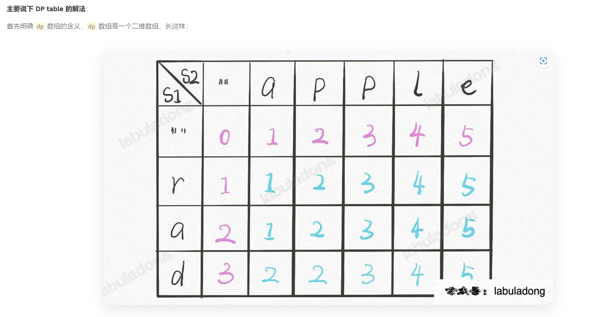

有了之前递归解法的铺垫，应该很容易理解。dp[..][0] 和 dp[0][..] 对应 base case，dp[i][j] 的含义和之前的 dp 函数类似：

int dp(String s1, int i, String s2, int j)
// 返回 s1[0..i] 和 s2[0..j] 的最小编辑距离

dp[i-1][j-1]
// 存储 s1[0..i] 和 s2[0..j] 的最小编辑距离